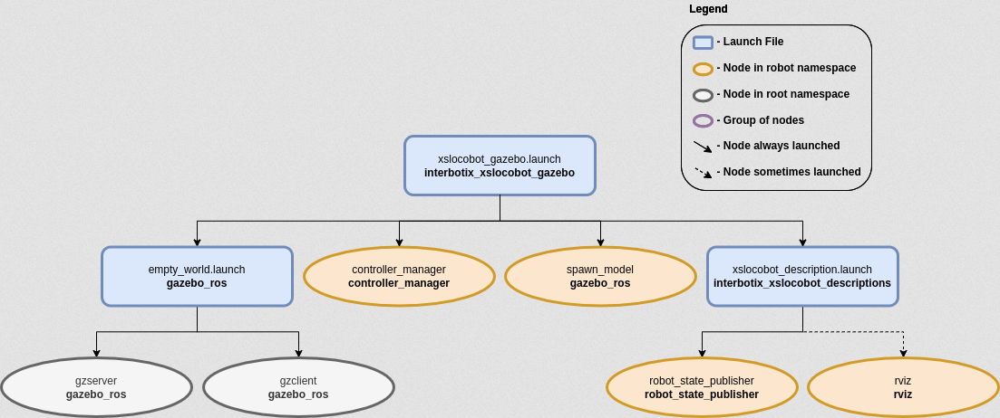

# Gazebo Simulation

This package contains the necessary config files to get any rover in our X-Series Interbotix LoCoBot Family simulated in Gazebo. Specifically, it contains the locobot_configs.gazebo file which allows the black texture of the robot to display properly (following this method) and starts various plugins. It also contains YAML files with tuned PID gains for the arm, gripper, and pan/tilt joints so that ros_control can control the robot effectively. This package can either be used in conjunction with MoveIt via the FollowJointTrajectory interface or by itself via the JointPositionController interface.

## Structure of this package


## Usage

To run this package, type the line below in a terminal (assuming the locobot_wx250s is being launched with the lidar attached and using trajectory controllers for the arm).
```
roslaunch interbotix_xslocobot_gazebo xslocobot_gazebo.launch robot_model:=locobot_wx250s show_lidar:=true use_trajectory_controllers:=true
```
If you want use MoveIt Motion Planning to control the robot's arm in Gazebo Simulation, you should use command from MoveIt
```
roslaunch interbotix_xslocobot_moveit xslocobot_moveit.launch robot_model:=locobot_wx250s show_lidar:=true use_gazebo:=true
```
**Since by default, Gazebo is started in a 'paused' state (this is done to give time for the controllers to kick in), unpause the physics once it is fully loaded by typing:**
```
rosservice call /gazebo/unpause_physics
```
Once the MoveIt GUI is fully loaded, take a look at the available planning groups. There should be two of them - one called 'interbotix_arm' and the other called 'interbotix_gripper'. The 'interbotix_arm' group contains the joints needed to plan the trajectories for the whole arm (excluding the gripper) while the 'interbotix_gripper' group contains the joints needed to plan the trajectories for the gripper (based on the linear distance from the 'right_finger_link' to the 'fingers_link'). There are a few saved poses for each of these groups that be executed such as 'home', 'sleep', and 'upright' poses for the 'interbotix_arm' group, and 'open', 'close', and 'home' for the 'interbotix_gripper' group ('home' just moves the gripper such that the angular position of the motor is at 0 radians). Also, it should be noted that the gripper frame of reference is located at the 'ee_gripper_link'.

Additionally, by default, the MoveIt GUI does not display the green or orange robots that represent the start and goal states for the arm respectively. To display them, navigate to the MotionPlanning -> Planning Request dropdown in RViz and check the Query Start State and Query Goal State checkboxes.